# Online GameShop
## Project Overview
Our website for this project is called “Gamers!”. As its name has already descried, it is a website mainly served for video game lovers and players. The websites can be separate into three parts: the sign up/ log in part which provide the member’s only function, game filter part which enable user to categorize the game and game detail part which enable the user to view the information of the games and leave comments there.

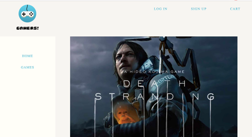

*Basic Layout of our whole websites. Contains a logo, top navigation bar for sign up/log in and a left navigation bar for quick direction*

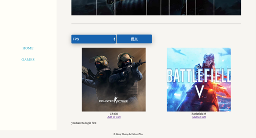

*Game filter page. By selecting the game genre and press the submit button beside the database will help the user to categorize games.*

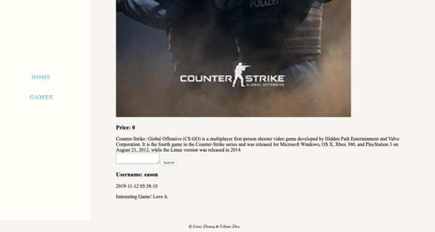

*Game’s detail page. Here users can view the detailed information of each game. Valid user can also leave the comments at this page.*

## Database Design & ER diagram
Our website “Gamers!” is trying to create an online gaming center which can help users to better acknowledge and clarify the genre of the games. As a result, we decided to categorize our database into three parts: “users”, “games” and “comments”. Among all of these, the “users” column is distinguished by “email”, mainly used to serve the login and registration function and help to separate the member’s only pages (such as the user’s center, user’s cart) from the visitors. The “game” column is distinguished by “gameID”, and each of them contains a game name, game genre, game description, game price and a game URL. Lastly, “comments” is served for the commenting function in the game detail pages and it is the weak entity that belongs to the “games” (only when there is a user, there can have the comment, visitors cannot write comments). It will record the game ID and username into the database. Thus, whenever a certain user submits his/her comment, the database will match the username of the user with the game ID so it can display all these information correctly. Currently we only use session function to handle the “add to cart”, thus the website will not record user’s cart if they log out (that is to say, there is no relationship between the “users” and the “games” so far, but in the future we may add another column inside the “users” to implement this feature and enable the database to keep the record of user’s cart).

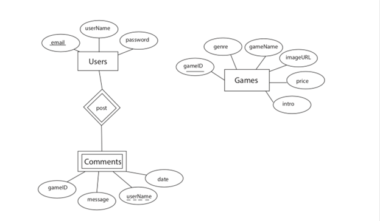

*ER Diagram*

## Database Connectivity Code
We created a separated file called databaseConnect and linked all of our websites with it so we do not need to copy and paste all these same codes again and again.

## Secure Authentication Handling
Inside our website there are lots of pages that are only available for valid users (such as the user’s center page which they can reset their password, logout page and add to cart page). If the visitor accidently enters these pages without proper account (we have set a bunch of codes to verify whether the browser is a valid user or just a visitor), the website will bump up a warning that tell the visitor must log in first. Below the warning we also provide the link to log in and sign up pages for saving their time. 

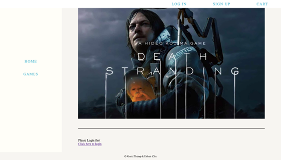

*Secure authentication.*

## Member Registration and Login
Inside our website we create a top navigation bar which always display the button that links to the login and sign up pages. When the visitor enters the sign-up page, they will be required to enter their e-mail and create a username and password for their account. Once they hit the submit button, the system will check whether the email has already existed inside the database. If the answer is yes, a warning will bump up and ask the visitor to use another address. If the e-mail address is unique, this account will be sent to the database and user will automatically log in. At the same time, if the user tries to login with an invalid e-mail or password, a warning will bump up. A quick access button links to the signup page will be provided like I have mentioned in the previous part. Once the user enters their account successfully, the signup button inside the top navigation bar will be replaced with their username and users can change their password and log out inside the user’s center (member.php).

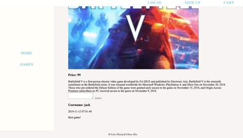

*Visitor can access to game’s detail page and view all the content. But they are unable to comment.*

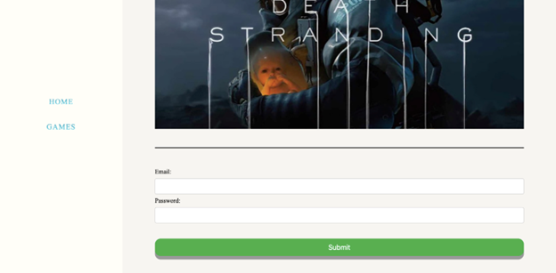

*Login page*

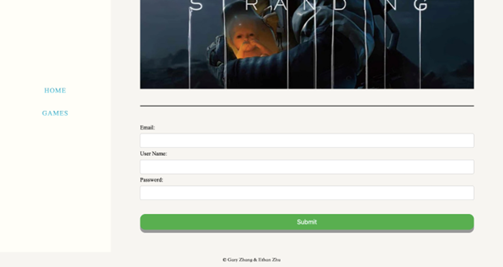

*Signup page*

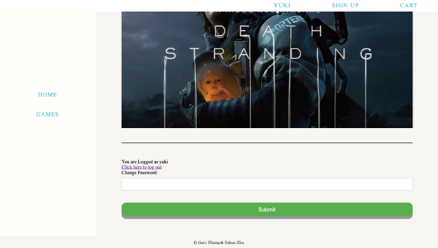

*User’s center page. Notice the log in button inside the top-navigation bar has been replaced by username.*

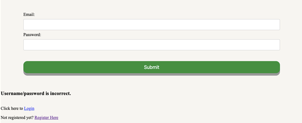

*Invalid login warning.*

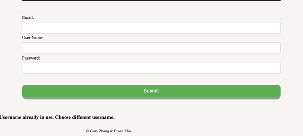

*Duplicated username/e-mail warning.*

